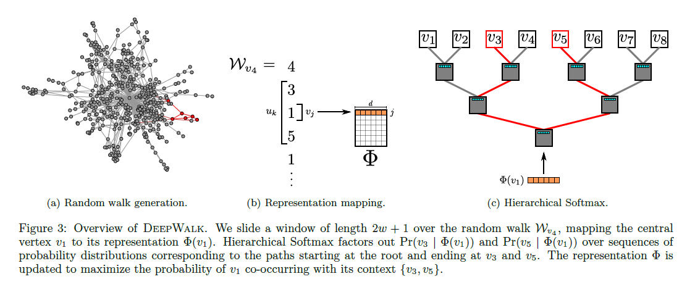

# DeepWalk: Online Learning of Social Representations

* Authors: B. Perozzi, R. Al-Rfou, and S. Skiena
* Proceedings of the KDD 2014

## Keywords

graph, random walk, language model, word2vec, skipgram

## Summary

It is the implementation of Word2Vec(Skipgram) in node-embedding of Graph domain. The contributions of this methodology are:

* Deep learning as a tool to analyze graphs, to build robust representations
* Significantly increaed classification performance in the presence of label sparsity
* The Scalability of algorithm by building representations of web-scale graphs using parallel processing



[Detailed Summary](https://www.notion.so/DeepWalk-Online-Learning-of-Social-Representations-b843fd5070864c31b1c36696cd9b26cf)

## Usage

The code can be run as following process.

```bash
python main.py
```

```python
# main.py

def main():
    data_dir = './gnn/data/social_data'
    mat_file = 'blogcatalog.mat'

    n_shuffles = 2
    training_percents = [0.1, 0.5, 0.9]

    # https://github.com/phanein/deepwalk/blob/master/example_graphs/scoring.py
    # Load Graph
    graph = utils.load_matfile(os.path.join(data_dir, mat_file),
                               variable_name='network',
                               to_graph=True)

    # Load Labels
    label = utils.load_matfile(os.path.join(data_dir, mat_file),
                               variable_name='group',
                               to_graph=False)
    n_labels = label.shape[1]
    mlb = MultiLabelBinarizer(classes=range(n_labels))

    # DeepWalk
    model = deepwalk.deepwalk(graph,
                              walks_per_vertex=80,
                              walk_length=40,
                              embedding_size=128,
                              window_size=10,
                              random_state=89).fit()

    # Map nodes to their features (note:  assumes nodes are labeled as integers 1:N)
    embedding = np.asarray([model[str(node)] for node in range(len(graph))])

    # 2. Shuffle, to create train/test groups
    shuffles = []
    for _ in range(n_shuffles):
        shuffles.append(skshuffle(embedding, label))

    # 3. to score each train/test group
    all_results = defaultdict(list)

    for train_percent in training_percents:
        for shuf in shuffles:
    
            X, y = shuf
        
            training_size = int(train_percent * X.shape[0])
        
            X_train = X[:training_size, :]
            y_train_ = y[:training_size]
        
            y_train = [[] for x in range(y_train_.shape[0])]
        
        
            cy =  y_train_.tocoo()
            for i, j in zip(cy.row, cy.col):
                y_train[i].append(j)
        
            assert sum(len(l) for l in y_train) == y_train_.nnz
        
            X_test = X[training_size:, :]
            y_test_ = y[training_size:]
        
            y_test = [[] for _ in range(y_test_.shape[0])]
        
            cy =  y_test_.tocoo()
            for i, j in zip(cy.row, cy.col):
                y_test[i].append(j)
        
            clf = deepwalk.TopKRanker(LogisticRegression())
            clf.fit(X_train, y_train_)
        
            # find out how many labels should be predicted
            top_k_list = [len(l) for l in y_test]
            preds = clf.predict(X_test, top_k_list)
        
            results = {}
            averages = ["micro", "macro"]
            for average in averages:
                results[average] = f1_score(mlb.fit_transform(y_test),
                                            mlb.fit_transform(preds),
                                            average=average)
        
            all_results[train_percent].append(results)
    
    print ('Results, using embeddings of dimensionality', X.shape[1])
    print ('-------------------')
    for train_percent in sorted(all_results.keys()):
        print('Train percent:', train_percent)
        for index, result in enumerate(all_results[train_percent]):
            print('Shuffle #%d:   ' % (index + 1), result)
        avg_score = defaultdict(float)
        for score_dict in all_results[train_percent]:
            for metric, score in iteritems(score_dict):
                avg_score[metric] += score
        for metric in avg_score:
            avg_score[metric] /= len(all_results[train_percent])
        print ('Average score:', dict(avg_score))
        print ('-------------------')

if __name__ == '__main__':
    main()
```