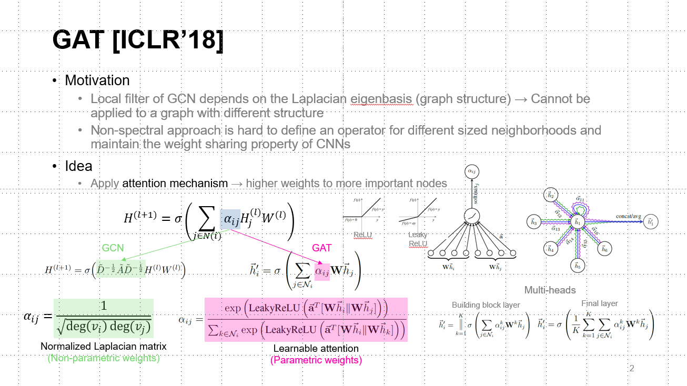

# GAT: Graph Attention Networks

* Authors: Petar Velickovic, Guillem Cucurull, Arantxa Casanova, Adriana Romero, Pietro Lio, Yoshua Bengio
* Proceedings of ICLR 2018

## Keywords

graph, attention, neural networks, convolutional networks, inductive, transductive

## Summary



## Usage

The code can be run as following process.

```bash
# Transductive Task (cora)
python main_transductive.py

# Inductive Task (ppi)
python main_inductive.py
```
