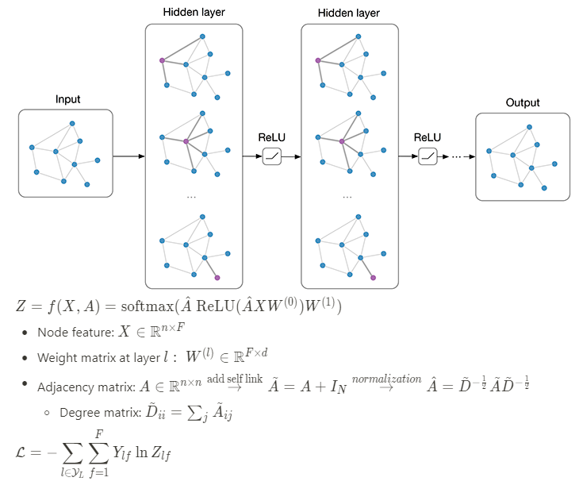

# GCN: Semi-Supervised Classification with Graph Convolutional Networks

* Authors: Thomas N. Kipf, Max Welling
* Proceedings of ICLR 2017

## Keywords

graph, convolutional networks, spectral graph, convolution, graph Fourier transform, neural networks

## Summary



[Detailed Summary](https://www.notion.so/GCN-Semi-supervised-Classification-with-Graph-Convolutional-Networks-b27d3de0ea3447a2b3d48e00d94ca7a5)

## Usage

The code can be run as following process.

```bash
python main.py
```