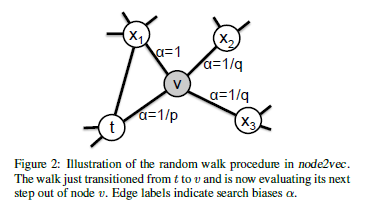
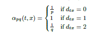

# node2vec: Scalable Feature Learning for Networks

* Authors: A. Grover and Jure Leskovec
* Proceedings of the KDD 2016

## Keywords

graph, random walk, language model, word2vec, skipgram, sampling strategy, alias sampling

## Summary

It is an enhanced version of DeepWalk(the implementation of Word2Vec(Skipgram) in graph domain) with adjustment of sampling strategy.





* d_tx denotes the shortest path distance between node x and node t.

[Detailed Summary](https://www.notion.so/node2vec-Scalable-Feature-Learning-for-Networks-295f053097664a9d96ceeb1d3d9869f7)

## Usage

The code can be run as following process.

```bash
python main.py
```
