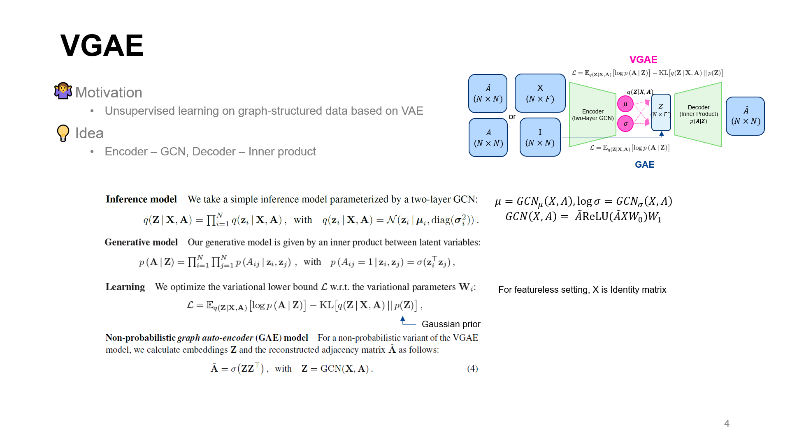

# VGAE: Variational Graph Auto-Encoder

* Authors: Thomas N. Kipf, Max Welling
* arXiv:1611.07308v1

## Keywords

graph, variational bayesian, variational auto-encoder, generative model

## Summary



## Usage

The code can be run as following process:

```bash
python main.py
```

## Reference

> https://github.com/tkipf/gae
> https://github.com/DaehanKim/vgae_pytorch
