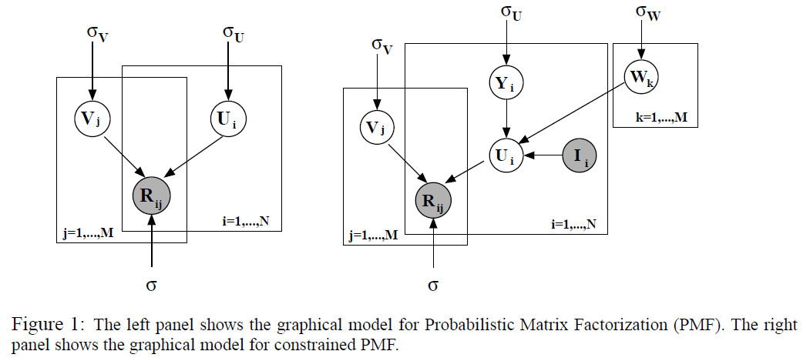
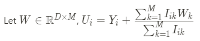

# Probabilistic Matrix Factorization (PMF)

* Authers: R. Salakhutdinov and A. Mnih
* Proceedings of the NeurIPS 2017

## Keywords

collborative filtering, recommender systems, explicit feedback, matrix factorization, latent factor model, baysian approach

## Summary

It presents a probabilistic algorithm (MAP) that scales linearly with the number of observations with controlling the model complexity automatically based on training data:

* Introducing priors for the hyperparameters
* Maximizing the log-posterior of the model over both parameters and hyperparameters

In addition, it introduces latent similarity constraint matrix in the user matrix that makes perform well on very sparse and imbalanced data

